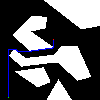
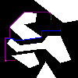

# Path Finder

This is my submission for a take home assessment for TetraMem. 

## Usage

Open path_finder.py and scroll down to main(). Set CHOSEN_EXAMPLE and choose whether to run one_pair() or two_pairs()

## Results

#### One pair

    
    
    

 

#### Two pairs

    
    
    

 

